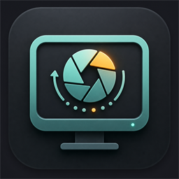
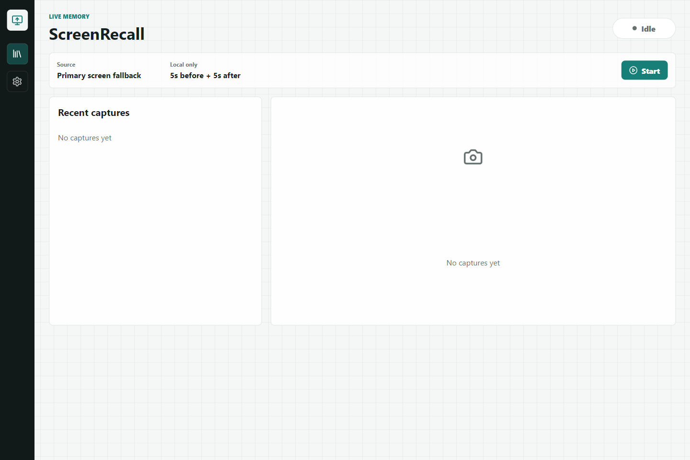

<p align="right">
  <a href="README.md">English</a> | <strong>中文</strong>
</p>

<p align="center">
  
</p>

# ScreenRecall


ScreenRecall 是一个本地优先的桌面端 MVP。它可以在后台观察当前屏幕，识别信息密集的关键画面，并保存关键帧图片；开启 Live Photo 后，还会保存关键画面前后的短视频片段。



## 亮点

- 运行时不调用云端 API，屏幕捕获、分析、OCR 和保存都在本地完成。
- 类似 Live Photo 的捕获体验：保存关键帧，同时可保存关键画面前后的 WebM 短视频。
- 15 秒内存环形视频缓存，只在确认关键画面后才落盘。
- 基于画面密度、结构边缘、稳定度、本地 OCR/文字信号的关键画面判断。
- 支持后台运行、托盘控制，以及关闭窗口后隐藏到后台。
- 支持设置图片路径、视频路径、Live Photo、语言、捕获状态和排除应用列表。
- 支持英文和简体中文界面。
- 基于 Electron，面向 Windows 和 macOS 桌面环境。

## 环境要求

- Node.js 20+
- npm
- Windows 10/11 或 macOS

macOS 需要在系统设置中授予 Screen Recording（屏幕录制）权限后才能开始捕获。

## 快速开始

```bash
git clone https://github.com/tangguo95/ScreenRecall.git
cd ScreenRecall
npm install
npm run dev
```

构建生产产物：

```bash
npm run build
```

运行测试：

```bash
npm test
```

## 使用方式

1. 启动 ScreenRecall。
2. 点击 **Start** 开始后台捕获。
3. 正常工作、观看直播、查看课件或浏览教程。
4. 当 ScreenRecall 识别到关键的信息画面时，会保存：
   - `PNG` 关键帧图片。
   - 开启 Live Photo 时保存 `WebM` 短视频。
   - 本地 JSON 元数据，包括触发原因、OCR/文字信号、路径、来源、语言和相似度 hash。

默认保存结构：

```text
{imageSaveDir}/YYYY-MM-DD/{timestamp}.png
{videoSaveDir}/YYYY-MM-DD/{timestamp}.webm
```

## 项目结构

```text
ScreenRecall/
├─ assets/icons/              # 应用图标 PNG/ICO/ICNS 资源
├─ docs/images/               # README 使用的公开截图
├─ src/main/                  # Electron 主进程、托盘、IPC、本地服务
├─ src/preload/               # 安全的渲染进程桥接层
├─ src/renderer/              # React 界面和捕获引擎
├─ src/shared/                # 共享类型、环形缓存、分析与去重逻辑
└─ src/tests/                 # Vitest 单元测试
```

## 隐私与安全说明

- ScreenRecall 以本地运行为核心设计。屏幕帧、短视频、OCR 和元数据都保留在本机。
- MVP 不上传屏幕内容，不提供账号系统，运行时不调用在线 AI、在线 OCR 或在线转码服务。
- OCR 使用通过 npm 依赖打包的本地 Tesseract 语言数据。
- 排除应用通过本地前台应用名称匹配实现，它是 MVP 阶段的实用保护，不等同于完整的数据防泄漏系统。
- 当前 Live Photo 短视频保存为 WebM。后续可以通过本地打包 FFmpeg 增加 MP4 导出。

## 验证情况

当前已经完成的本地验证包括：

- 环形缓存保留策略、相似画面去重、关键帧分析的单元测试。
- Windows 端到端验证：
  - 中英文切换
  - 开启 Live Photo 时生成图片和 WebM
  - 暂停与继续
  - 关闭窗口后后台存活
  - 关闭 Live Photo 时只生成图片
  - 排除应用阻止生成捕获事件

macOS 捕获路径已基于 Electron 实现，但由于屏幕录制权限行为与系统强相关，仍需要单独在 macOS 实机上验证。

## 常见问题

### ScreenRecall 会一直保存我的屏幕吗？

不会。它会在内存中维护一小段滚动视频缓存，只有识别到关键画面后才写入文件。

### 是否依赖云端 AI 或在线 OCR？

不依赖。运行时捕获、分析、OCR、元数据和保存逻辑都在本地完成。

### 为什么短视频是 WebM 而不是 MP4？

Electron/Chromium 可以在本地直接生成 WebM。MP4 通常需要额外打包本地转码工具，例如 FFmpeg。

### 它能识别所有重要画面吗？

还不能。MVP 优先覆盖表格、课件、文档页面、错误弹窗、游戏装备/状态页等信息密集画面。后续可以通过更多本地信号和用户反馈继续优化。

## 参与贡献

欢迎提交 Issue 和 Pull Request。核心捕获、OCR、转码等能力请尽量保持本地优先，避免引入云端依赖。

## AI 辅助开发

本项目在作者主导与审阅下，借助 OpenAI Codex 完成设计、实现、文档编写与细节打磨。

## 联系方式

维护者：[tangguo95](https://github.com/tangguo95)。

## 许可证

MIT License。详见 [LICENSE](LICENSE)。
